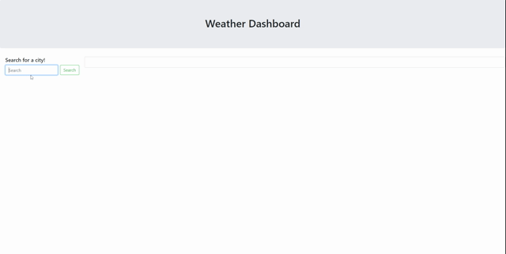

# Weather-App

-- Motivation:  The motivation for this project was to create a web based weather application that provides users with both the current weather and a future 5 day forecast.  Users will receive information based
upon the city that is entered into the input field.  Once a city is selected users will be able to view data from the current day including sky condition, humidity, temprature, wind and UV index.  Users will also
be able to view a 5 day forecast that will display the sky condition, temprature and humidity.  Users previous searches are saved on a sidebar and are also saved in local storage.  Users can click on a city that
is populated in the sidebar to load that city data from local storage.  

-- Usage:  To use this app users must first enter a city and click the submit button, or the return key.  Only one city may be entered at a time, but previous searches will be saved for later access.  
Users can reterive data from any of their previous searches by clicking on a city name stored in a list on the left hand side of the webpage.  The app can be used to plan trips, prepare for incoming weather and
view weather data from outside their current location.

-- Demonstration:

